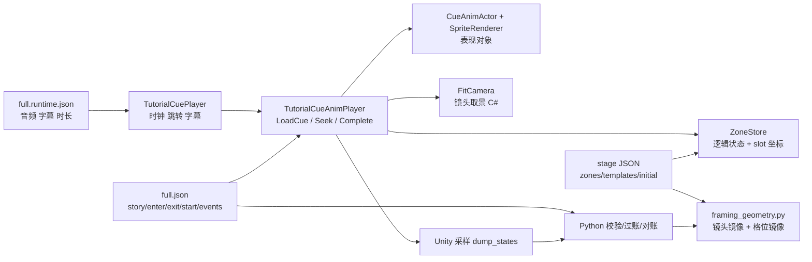

# 讲规动画系统整体重构

> 状态：阶段 0 已审计，目标架构与 v2 schema 初稿。
> 适用：`games/{game}/tutorial/anim/`、`client/Assets/Scripts/Tutorial/`、`scripts/*anim*`。
> 原则：**源数据先文字化，运行时编译后只做确定性执行；一个几何源；没有 god class。**

---

## 0. 硬约束与本次重构的定位

这次不是继续修补 `TutorialCueAnimPlayer`，而是把讲规动画拆成可独立理解的几层：

1. **Data / Schema**：手写源数据只写“文字脚本 + 契约 + 原语 + 树/世界声明”。
2. **Compiler**：确定性地把源数据编译成运行时可直接执行的资产，包括入口/出口状态、镜头几何、具体组件 id、补间片段。
3. **Runtime Core**：纯 C# 模型只做 `StateStore`、`TimelineEvaluator`、`WorldRuntime`，不碰 Unity 渲染。
4. **Unity Presentation**：`ActorBinder`、`SpriteLibrary`、`TutorialAnimPlayer`，从编译资产画画面。
5. **Tools**：静态校验、规则过账、Unity 采样对账、BoardAI API 合法性问句，全部围绕同一套源数据。

以后新建/修改动画必须按固定生产流程：

`改文字脚本 → 调 BoardAI API 确认合法性 → 套原语 → 编译 → 对账 + 用户视觉验收`

不允许：

- 运行时调用 LLM；
- 为单条动画写协程；
- 多个职责塞进一个 god class；
- 只做最小兼容补丁；
- 文字、契约、events、镜头、树/world 各自漂移。

---

## 1. 阶段 0：代码与数据审计

### 1.1 现状规模

现有相关实现：

| 区域 | 文件 | 行数/规模 | 结论 |
|---|---|---:|---|
| 动画播放 god class | `client/Assets/Scripts/Tutorial/TutorialCueAnimPlayer.cs` | 3249 行 / 约 96 个方法 | **重写并拆散** |
| 高亮 partial | `TutorialCueAnimPlayer.Highlight.cs` | 262 行 | 并入亮显处理器，旧实现删除 |
| 指示物 partial | `TutorialCueAnimPlayer.Pointers.cs` | 218 行 | 并入 Primitive 表现层，旧实现删除 |
| 状态账本 | `Tutorial/ZoneStore.cs` | 966 行 / 约 44 个方法 | **重写为纯 C# StateStore** |
| 数据模型 | `Tutorial/TutorialCueAnimData.cs` | 722 行 | 重写为 v2 schema |
| 音频/字幕/跳转控制 | `Tutorial/TutorialCuePlayer.cs` | 600 行 | 保留职责，改成只驱动新 Player |
| 旧 tutorial.json 数据模型 | `Tutorial/TutorialData.cs` | 136 行 | 删除 |
| 旧 tutorial.json 播放器 | `Tutorial/TutorialDirector.cs` | 834 行 | 删除 |
| 旧教学脚手架 | `Scripts/TutorialPlayer.cs` | 240 行 | 删除 |
| 旧 Teaching* 路径 | `Scripts/TeachingPlayer.cs`、`TeachingData.cs`、`TeachingAssets.cs` | 694 行 | 删除 |
| 旧补间库 | `Scripts/TweenLibrary.cs` | 207 行 | 删除 |
| 旧精灵工厂 | `Scripts/GameSpriteFactory.cs` | 272 行 | 保留/评估，只给占位兜底 |
| 旧动画原语 | `Tutorial/TutorialPrimitives.cs` | 200 行 | 删除，语义已进新 compiler/event |
| 编辑器采样 | `client/Assets/Editor/TutorialFrameCapture.cs` | 762 行 | 重写为加载编译资产并采样 |
| Python 动画工具 | `validate_cue_anim.py` 等 9 个文件 | 约 3583 行 | 分阶段重写/适配 |

数据现状：

| 文件 | 大小 | 结论 |
|---|---:|---|
| `games/splendor/tutorial/anim/full.json` | 443,730 B | v1 源数据，**schema 重写为 v2** |
| `_stage/splendor.table.json` | 46,848 B | 拆成 v2 stage，保留内容，重命名/整理 |
| `_stage/splendor.cards_demo.json` | 54,238 B | overlay tree stage，保留语义，进入 v2 |
| 其余 6 个独立 stage | 666 B–9,885 B | 保留语义，进入 v2 |
| `games/splendor/tutorial/script.full.json` | 54,535 B | 口播编辑源，保留，只做 cue id 对齐 |
| `games/splendor/tutorial/full.runtime.json` | 497,761 B | 音频/字幕 runtime，保留 |
| `games/splendor/tutorial/anim/full.exitstate.json` | 2.2 MB | 生成物，不入库/不手改，继续采样生成 |

### 1.2 现有职责图



这张图里最危险的两条边：

1. `C` 同时承担状态、树、镜头、actor、原语、时间轴、调试，任何一处改动都要读 3000 行。
2. `F` 和 `J` 是同一套镜头数学的两份实现，已经发生漂移。

### 1.3 现有数据流

```text
script.full.json / full.lrc
        │
        ▼
full.runtime.json ──音频/字幕/时长──▶ TutorialCuePlayer
        │                                      │
        │ cue id                                ▼
        └──────────────────────────────▶ TutorialCueAnimPlayer
                                                │
full.json (story/enter/exit/start/events) ──────┤
                                                │
stage JSON ─────▶ ZoneStore ──slot 坐标─────────┘
                                                │
framing_geometry.py ◀── Python 校验/对账 ────────┘
                                                │
                                                ▼
                                      Unity dump_states → check_cue_script
```

问题：

- `enter/exit` 和 `events` 由同一份手写文件维护，但工具只能证明“数据 == 引擎”，不能证明“数据 == 口播意图”。
- 树/world 是后加的：`tree` 只写了 40/109 条，其余默认主树；`entry_from` 未真正被引擎用于父链。
- `LoadCue` 同时负责换 stage、重放入口链、建 actor、切镜头、应用 at=0 事件，职责过多。
- `ZoneStore` 既算状态又算槽位坐标，Python 又镜像一套槽位坐标。
- `Clip` 列表在运行期累积，`Seek` 既触发事件又采样片段，离屏验证和交互跳转依赖隐式状态。
- 残余旧路径 `TutorialPlayer` / `TutorialDirector` / `TeachingPlayer` / `TeachingData` / `TeachingAssets` / `TweenLibrary` / `TutorialPrimitives` 仍在工程里，下一步会删除。

### 1.4 保留 / 重写 / 删除清单

#### 保留并适配

| 文件 | 处理 |
|---|---|
| `Tutorial/CardImageLoader.cs` | 保留为 `SpriteLibrary` 的底层图片解码/去白边/掩码工具 |
| `Tutorial/Palette.cs` | 保留，作为 v2 stage 色板解析 |
| `Tutorial/Easing.cs` | 保留，作为纯函数缓动 |
| `Tutorial/CueAnimActor.cs` | 重写为 `ActorHandle`，只保存 Unity 表现句柄 |
| `Tutorial/TutorialCuePlayer.cs` | 保留外壳，改为驱动 `TutorialAnimPlayer` |
| `Tutorial/TutorialCueData.cs` | 保留音频 runtime cue 模型，删除未用字段 |
| `Scripts/GameSpriteFactory.cs` | 先保留兜底，评估后决定是否删 |
| `scripts/qa_anim_ask.py` | 保留，阶段 3 接入 v2 校验流程 |

#### 重写

| 文件 | 目标 |
|---|---|
| `Tutorial/TutorialCueAnimPlayer.cs` | 拆成 Runtime Core + Presentation + Unity Player，单文件 <300 行 |
| `Tutorial/TutorialCueAnimPlayer.Highlight.cs` | 并入 `Presentation/PrimitivePresenter` |
| `Tutorial/TutorialCueAnimPlayer.Pointers.cs` | 并入 `Presentation/PrimitivePresenter` |
| `Tutorial/ZoneStore.cs` | 重写为 `Core/StateStore.cs`，纯逻辑、无 Unity、无坐标 |
| `Tutorial/TutorialCueAnimData.cs` | 重写为 `Schema/*.cs`（v2） |
| `Editor/TutorialFrameCapture.cs` | 重写为加载 `*.compiled.json` 的采样器 |
| `scripts/framing_geometry.py` | 升级为唯一几何编译源；不再被 C# 运行时镜像 |
| `scripts/validate_cue_anim.py` | 拆成 schema/契约/文字结构校验 |
| `scripts/validate_anim_rules.py` | 适配 v2 event selector |
| `scripts/check_cue_script.py` | 适配 v2 contract + compiled snapshot |
| `scripts/check_framing_flow.py` | 适配 v2 compiled camera |
| `scripts/dump_states.sh` | 改为采样新 Player 的 compiled track |

#### 删除

| 文件 | 理由 |
|---|---|
| `Scripts/TutorialPlayer.cs` | 旧硬编码原型 |
| `Scripts/TutorialDirector.cs` + `Tutorial/TutorialData.cs` | 旧 `tutorial.json` 路径 |
| `Scripts/TeachingPlayer.cs` | 旧 teaching 路径 |
| `Scripts/TeachingData.cs` | 旧 teaching 数据模型 |
| `Scripts/TeachingAssets.cs` | 旧 Resources/teaching 加载 |
| `Scripts/TweenLibrary.cs` | 旧 shot 补间库，与时间纯函数模型冲突 |
| `Tutorial/TutorialPrimitives.cs` | 旧 shot 原语，职责被 compiler 取代 |
| `client/Assets/Resources/teaching_splendor_setup.json` | 旧 teaching 数据 |
| `client/Assets/Resources/teaching/**` | 旧 teaching 资源路径 |
| `client/Assets/Scripts/Tutorial/TutorialCueAnimPlayer.cs` 旧实现 | 阶段 4 替换后删除 |
| `client/Assets/Scripts/Tutorial/ZoneStore.cs` 旧实现 | 阶段 4 替换后删除 |
| `client/Assets/Scripts/Tutorial/TutorialCueAnimData.cs` 旧实现 | 阶段 4 替换后删除 |
| `tutorial/` 旧 tutorial.json 文档/示例 | 阶段 5 改为新流程说明，不保留旧 schema 权威 |

> 删除动作放在阶段 5 统一执行；阶段 1–4 新代码并存，稳定切换后再删。

---

## 2. 目标架构

### 2.1 分层

```text
┌──────────────────────────────────────────────────────────┐
│ Authoring Source（手写）                                  │
│  *.anim.json  文字脚本 + 契约 + 原语 + tree/world 声明     │
│  *.stage.json 语义 zone / template / extent               │
└───────────────────────────┬──────────────────────────────┘
                            │ compile_animation.py（唯一确定性编译器）
                            ▼
┌──────────────────────────────────────────────────────────┐
│ Compiled Assets（生成、可校验）                            │
│  *.compiled.json                                          │
│   ├─ cue entry/exit 状态快照                               │
│   ├─ resolved primitive clips（具体组件 id、具体 slot）    │
│   ├─ camera frame（center / ortho / pitch）                │
│   └─ stage slot table（x,z per order）                     │
└───────────────────────────┬──────────────────────────────┘
                            ▼
┌──────────────────────────────────────────────────────────┐
│ Runtime Core（纯 C#，无 UnityEngine）                      │
│  StateStore / TimelineEvaluator / WorldRuntime            │
└───────────────────────────┬──────────────────────────────┘
                            ▼
┌──────────────────────────────────────────────────────────┐
│ Unity Presentation                                          │
│  ActorBinder / SpriteLibrary / CameraDirector              │
│  PrimitivePresenter / TutorialAnimPlayer                   │
└───────────────────────────┬──────────────────────────────┘
                            ▼
┌──────────────────────────────────────────────────────────┐
│ Tools                                                      │
│  schema lint / 规则过账 / Unity 采样对账 / BoardAI API      │
└──────────────────────────────────────────────────────────┘
```

### 2.2 关键设计决定

#### A. 几何只留一份：Python compiler 产出，C# 只读

`scripts/framing_geometry.py` 升级为 `stage_geometry.py` 的核心，负责：

- `zone -> slot table`：每个 `(zone, order)` 的 `(x,z)`。
- `camera spec -> frame`：`center`、`ortho_size`、`pitch`、可见矩形。
- tree/world extent 校验。

编译资产中写入：

```json
"slots": {
  "showcase": [
    {"order": 0, "x": -0.7, "z": 0.0},
    {"order": 1, "x": 0.0, "z": 0.0}
  ]
},
"camera": {
  "center": {"x": 0.0, "z": 0.0},
  "ortho_size": 0.95,
  "pitch": 90.0,
  "rect": [-1.2, 1.2, -0.8, 0.8]
}
```

C# 端删除 `FitCamera`、`ComputeZonePosition` 两套数学，只应用编译结果。这样就不会再有 C#/Python 两份几何各自演化。

#### B. 动画 = 时间的纯函数

运行时不再维护“片段累积队列”。编译期把每条 cue 编译为：

- `start_state`：本条 cue 入口的完整逻辑状态；
- `end_state`：本条 cue 出口的完整逻辑状态；
- `state_ops`：确定性的状态变更；
- `clips`：具体到 `item_id` 的视觉补间；
- `camera`：编译好的取景帧。

运行时 `TimelineEvaluator.Evaluate(cue, t)` 对任意 `t` 返回完整 `FrameState`：

- 逻辑状态按 `state_ops` 阶跃；
- 位置/缩放/透明度/面片由 `clips` 插值；
- 暂停、倒放、跳转、离屏采样都是同一函数换 `t`，不需要协程特判。

#### C. 状态 = zone + order + face

纯模型只有：

```csharp
ComponentState:
  Id, TemplateId, Palette, ConceptRef, ZoneId, Order, Face

WorldState:
  Dictionary<string, ComponentState> Components
  Zone occupancy 由 Order 排序派生，不存第二份真相
```

`StateStore` 提供：

- `Ensure(selector, zone, count, face)`
- `Spawn(selector, zone, count, face)`
- `Destroy(selector, zone, count)`
- `Transfer(selector, source, destination, quantity, toFace, order)`
- `Stack(selector, zone, capacity, real/pad, face)`
- `Shuffle(zone, seed)`
- `MoveOrder(zone, item, order)`
- `Snapshot()` / `Restore(snapshot)`

这些操作只影响逻辑状态；坐标与动画都是 compiler / presentation 的事。

#### D. Tree / World 正名

定义两类东西：

- **world**：状态世界。`isolated` 独立状态；`shared` 共享同一份 `WorldState`。
- **tree**：一个 world 的视觉舞台。一个 world 可以有多棵树（如 `main` 与 `cards_demo` 共享 `real` world），切换 tree 只换 stage，不重置状态。

目录树语义：

| world | 树 | 用途 |
|---|---|---|
| `box` | `box` | 盒面 |
| `cards_intro` | `cards_intro` | 发展卡介绍 |
| `gems_demo` | `gems_demo` | 宝石/黄金介绍 |
| `gems_count_demo` | `gems_count_demo` | 3/4 人数量演示 |
| `nobles_demo` | `nobles_demo` | 贵族介绍 |
| `marker_demo` | `marker_demo` | 起始玩家标记 |
| `real` | `main` + `cards_demo` | 真实牌桌 + overlay 演示 |

规则：

- 组件介绍默认独立 world，场内天然只有该组件。
- 同一 world 内换 tree 是 overlay/cut stage，状态继续。
- 跨 world 是状态 cut，新 world 从其树根入口重放/快照开始。
- 镜头 cut 必须在 `at=0` 原子完成；compiler 为每条换 tree/world 的 cue 生成 `camera` 帧并检查。

#### E. C# 目录与 assembly

```text
client/Assets/Scripts/Tutorial/
  BoardGameTutorial.Animation.asmdef
  Schema/
    TrackDef.cs             // v2 手写源数据序列化模型
    StageDef.cs
    EventDef.cs
    ContractDef.cs
    CompiledDef.cs          // 编译资产序列化模型
  Core/
    ComponentState.cs
    WorldState.cs
    StateStore.cs
    TimelineModel.cs
    TimelineEvaluator.cs
    WorldRuntime.cs
  Presentation/
    StageRuntime.cs
    ActorBinder.cs
    SpriteLibrary.cs
    CameraDirector.cs
    PrimitivePresenter.cs
  Unity/
    TutorialAnimPlayer.cs   // 薄 MonoBehaviour，唯一 Unity 入口
  Legacy/                   // 阶段 5 删除
```

新 `TutorialAnimPlayer` 目标职责：

- 接收 `(gameRoot, track, cueId, seekTime)`；
- 从 `*.compiled.json` 读编译条目；
- 把 `FrameState` 交给 `ActorBinder` 和 `CameraDirector`；
- 不再自己解析 `full.json`、不再自己算取景、不再写状态选择器。

---

## 3. v2 数据 Schema

### 3.1 源文件：`{track}.anim.json`

```json
{
  "schema": "tutorial-anim/v2",
  "kind": "animation_track",
  "game": "splendor",
  "track": "full",
  "default_tree": "main",
  "worlds": [
    {
      "id": "real",
      "mode": "shared",
      "why": "真实牌桌状态；main 与 cards_demo 共享"
    }
  ],
  "trees": [
    {
      "id": "main",
      "world": "real",
      "stage": "_stage/main.stage.json",
      "purpose": "真实牌桌：发展卡、宝石、贵族、玩家区",
      "initial": "空桌，所有组件由 setup 事件 create",
      "extent_note": "只框实际入镜的 zone"
    }
  ],
  "cues": [
    {
      "id": "setup.cards.001.1",
      "parent": null,
      "tree": "main",
      "transition": "world_cut",
      "timing": {
        "显示卡面": "0.30-2.50"
      },
      "script": {
        "story": "【这是发展卡牌，共90张】先把 Game Box 收起，再摆出一张发展卡正面。",
        "note": "文字说了展卡，没说什么就不做。",
        "camera": {
          "zones": ["showcase"],
          "fill": 0.72,
          "at": 0.0
        },
        "enter": {
          "picture": "media/box.png",
          "zones": {"showcase": {"items": []}}
        },
        "exit": {
          "picture": null,
          "zones": {
            "showcase": {
              "items": [
                {"template": "sample_card_1", "palette": "card_level_1", "count": 1, "face": "up"}
              ]
            }
          }
        }
      },
      "events": [
        {"at": 0.0, "dur": 0.0, "op": "show", "picture": null},
        {"at": 0.15, "dur": 0.0, "op": "create",
         "template": "sample_card_1", "palette": "card_level_1",
         "zone": "showcase", "count": 1, "to": "face_up"}
      ]
    }
  ]
}
```

约束：

- `schema` 必须存在且为已知版本。
- 每条 cue 必须有 `script.story`、`script.enter`、`script.exit`、`tree`、`transition`。
- `transition` 取值：
  - `continue`：同一 world、同一 stage，状态延续；
  - `overlay`：同一 world、换 stage，状态延续；
  - `cut`：同一 world、换 stage 并重置取景（通常 overlay 入口）；
  - `world_cut`：跨 world，状态重置/从快照开始。
- `script.camera` 写 zone 列表与 fill，不写坐标。`at` 必须为 0 才是原子 cut；非 0 只允许同 cue 内同 stage 的推进。
- `events` 按 `at` 非降序；编译前必须排序稳定。
- 文字脚本中提到的组件主体，必须在 `enter/exit` 或 `events` 中出现；反之结构里出现的组件必须能在文字中找到依据。阶段 3 加 `text-structure lint`。

### 3.2 状态契约

v2 契约不再用“一级正面/宝石白”这类需要翻译的语义名，直接用 stage 已定义的 `template + palette`：

```json
"zones": {
  "showcase": {
    "items": [
      {"template": "sample_card_1", "palette": "card_level_1", "count": 1, "face": "up"}
    ]
  }
}
```

- 只声明本条关心的 zone，不做全桌快照。
- `face` 只对有 `back_image` 的模板成立；校验器负责报错。
- 退出契约与下一条入口契约的差异，由 compiler 计算完整快照后校验；对账时再和 Unity 采样比。
- `picture` 默认参与对账：没写 = 不该有整幅图。

### 3.3 事件原语

状态类原语（必须只描述逻辑状态变化）：

| `op` | 字段 | 语义 |
|---|---|---|
| `ensure` | 选择器字段, `zone`, `count`, `to` | 幂等补齐到 count，用于初始状态/重播 |
| `create` | 选择器字段, `zone`, `count`, `to` | 从盒里出现 N 件 |
| `destroy` | 选择器字段, `zone`, `count` | 放回盒里 |
| `transfer` | 选择器字段, `source`, `destination`, `quantity`, `to`, `order`, `slot` | zone→zone，可带终态朝向 |
| `stack` | 选择器字段, `destination`, `capacity`, `real`, `pad`, `to` | 一步建一摞确定身份的牌 |
| `shuffle` | `zone`, `seed` | 确定性洗混（纯函数 fake shuffle） |
| `move_order` | 选择器字段, `zone`, `index` | 仅改 zone 内 order |

表现类原语（不进入 StateStore）：

| `op` | 字段 | 语义 |
|---|---|---|
| `show` | `picture` | 整幅图 on/off |
| `highlight` | 选择器字段, `zone`, `grow`, `peak_alpha`, `lead`, `dur`, `easing` | 临时放大/发光 |
| `point` | 选择器字段, `part`, `indicator`, `lead`, `dur` | 指示物指向模板部位 |
| `fade` | 选择器字段, `to_alpha`, `lead`, `dur`, `easing` | 视觉透明度 |
| `scale` | 选择器字段, `scale`, `mode`, `lead`, `dur`, `easing` | 视觉缩放 |
| `wait` | `dur`, `lead` | 仅占位/留白，不改变状态 |

选择器字段（直接写在事件上，不再额外包一层 `selector`）为：

```json
{
  "concept": "development_card_level_1",
  "template": "sample_card_1",
  "palette": "card_level_1",
  "parts": [{"key": "bonus", "value": "<emerald>"}]
}
```

选择器最多指定一种身份规则；compiler 负责在入口状态/前序事件中解析出具体 `item_id`。如果解析结果为空或多义，直接编译错误。

### 3.4 Stage 源文件：`*.stage.json`

```json
{
  "schema": "tutorial-stage/v2",
  "kind": "stage",
  "game": "splendor",
  "id": "main",
  "pitch": 90.0,
  "aspect": 1.7778,
  "extent": {"min_x": -3.23, "max_x": 1.31, "min_z": -5.6, "max_z": 5.0},
  "zones": [
    {
      "id": "showcase",
      "label": "展示位",
      "role": "zone",
      "center": {"x": 0.0, "z": 0.0},
      "size": {"w": 0.63, "h": 0.88},
      "layout": {"type": "row", "capacity": 4, "x_step": 0.7, "z_step": 0.0},
      "display": {"mode": "slice", "max_visible": 2}
    }
  ],
  "templates": [
    {
      "id": "sample_card_1",
      "shape": "card",
      "palette": "card_level_1",
      "face_image": "media/cards/sample_1.png",
      "back_image": "media/cards/back_1.png",
      "world_size": {"w": 0.63, "h": 0.88}
    }
  ]
}
```

阶段 1 做一轮 normalize：

- `size` 与 `world_size` 只留一套，单位明确为世界单位。
- `layout.capacity` 从 `zones[].capacity` 上移。
- `zone_defs` / `anchors` / `containers` 先保留兼容语义，阶段 4 视使用情况删除。
- `display.mode` 只保留 `pile`、`row`、`grid`、`stack`、`slice` 五种之一。

### 3.5 编译资产：`{track}.compiled.json`

```json
{
  "schema": "tutorial-anim-compiled/v2",
  "source_sha256": "...",
  "game": "splendor",
  "track": "full",
  "trees": {
    "main": {"world": "real", "stage": "main"}
  },
  "cues": [
    {
      "id": "setup.cards.001.1",
      "tree": "main",
      "parent": null,
      "transition": "world_cut",
      "duration": 2.50,
      "camera": {
        "at": 0.0,
        "center": {"x": 0.0, "z": 0.0},
        "ortho_size": 0.95,
        "pitch": 90.0,
        "rect": [-1.2, 1.2, -0.8, 0.8]
      },
      "start_state": {"components": []},
      "end_state": {"components": []},
      "clips": [
        {
          "kind": "spawn",
          "at": 0.15,
          "item_id": "sample_card_1@1",
          "template": "sample_card_1",
          "palette": "card_level_1",
          "zone": "showcase",
          "order": 0,
          "from_slot": {"x": 0.0, "z": 0.0},
          "to_slot": {"x": 0.0, "z": 0.0},
          "face": "up"
        }
      ]
    }
  ]
}
```

编译产物是可入库的静态资产，但必须用 `git diff --exit-code` 或 `--check` 保证：

- 源文件改动后重新编译；
- 编译产物与源文件一致；
- Unity 只读 compiled，不解析 anim 源。

---

## 4. 迁移与删除清单（执行层面）

### 阶段 0（本文档）

- [x] 审计现状并产出本文档。
- [x] 建立“保留/重写/删除”清单。
- [x] 固定目标架构与 v2 schema 初稿。
- [ ] 提交阶段 0 commit。

### 阶段 1：新数据 schema 与纯模型

新增：

- `Schema/TrackDef.cs`、`StageDef.cs`、`EventDef.cs`、`ContractDef.cs`。
- `Core/ComponentState.cs`、`WorldState.cs`、`StateStore.cs`。
- `scripts/anim_schema_v2.py`：schema 常量、加载、基本校验。
- 示例数据 `games/splendor/tutorial/anim/v2/_schema_example.anim.json`。

删除：无。

验收：

- `check_unity_scripts.py` 通过。
- 新 schema 示例可按字段解析。
- `StateStore` 不引用 `UnityEngine`、不出现 `Vector3`。

### 阶段 2：新运行时核心

新增：

- `Core/TimelineEvaluator.cs`、`Core/WorldRuntime.cs`。
- `Presentation/CameraDirector.cs`、`ActorBinder.cs`、`SpriteLibrary.cs`、`PrimitivePresenter.cs`。
- `Unity/TutorialAnimPlayer.cs`。
- `scripts/compile_animation.py`：源 → compiled；几何由 `stage_geometry.py` 唯一实现。

删除：旧 `TutorialCueAnimPlayer` 的三个 partial 暂时保留但从新 Player 路径解耦。

验收：

- 新 Player 能加载一个示例 compiled cue 并 `Seek(t)`。
- `TutorialFrameCapture` 支持新 Player 采样。
- 没有运行期协程、没有 `FitCamera`/`ComputeZonePosition` 数学。

### 阶段 3：工具链

重写：

- `validate_anim_schema.py`（原 `validate_cue_anim.py` 拆分）。
- `validate_anim_rules.py`（适配 v2 selector）。
- `check_cue_script.py`（契约 vs Unity 采样）。
- `check_framing_flow.py`（compiled camera 链）。
- `compile_animation.py --check`。
- `qa_anim_ask.py` 与 `_qa/` 保持手写问句流程。

验收：

- 旧四件套等价链路全部可跑：
  - `compile_animation.py --check`
  - `validate_anim_schema.py`
  - `validate_anim_rules.py`
  - `dump_states.sh && check_cue_script.py --all`

### 阶段 4：Splendor UI1–30 垂直切片

- 先用旧数据 + compiler 生成可审计的 v2 草稿，再按“文字脚本 → BoardAI API → 原语”逐条复写/核对 UI1–30。
- 每条 cue 必须同时有：
  - `script.story/note/enter/exit/camera/tree/transition`
  - `events`
  - BoardAI 问句记录（若状态变化涉及规则）
- 切片通过后，用户视觉验收，再继续剩余 cue。

### 阶段 5：清理旧代码与文档

- 删除第 1.4 节“删除”清单。
- 更新 `.claude/memory/*.md` 与 `games/splendor/tutorial/anim/README.md`。
- 更新 `tutorial/README.md`，声明 v1 `tutorial.json` 退役。

---

## 5. 验收方式

| 验收项 | 工具/方式 | 标准 |
|---|---|---|
| Schema 与字段 | `validate_anim_schema.py` | 0 error |
| 文字与结构一致 | 新 lint | 文字提到的主体必须在契约/事件/取景出现 |
| 规则合法性 | `validate_anim_rules.py` + BoardAI API | 每条状态变化有规则依据 |
| 镜头几何唯一 | `stage_geometry.py` + `compile_animation.py --check` | compiled 与源一致，C# 无几何公式 |
| 运行时确定性 | `TutorialAnimPlayer.Seek(t)` | 任意 t 可采样，无协程依赖 |
| 数据 vs 引擎 | `dump_states.sh` + `check_cue_script.py --all` | 0 处不一致 |
| 构建 | `check_unity_scripts.py` | 编译通过 |
| 视觉 | Unity 播放 + 用户截图/录屏验收 | 用户明确通过 |
| 旧路径清理 | 删除后 `check_unity_scripts.py` | 编译、播放仍成立 |

推荐在 CI 中增加三条硬门槛：

```bash
python3 scripts/compile_animation.py --check
python3 scripts/validate_anim_schema.py
python3 scripts/check_unity_scripts.py
```

涉及 Unity 采样的两条保持本地/Windows 链路。

---

## 6. 风险与缓解

| 风险 | 原因 | 缓解 |
|---|---|---|
| v2 migration 量大 | 109 条 cue、8 个 stage | 先 UI1–30 垂直切片，后批量迁移；旧数据保留到阶段 5 |
| compiled 与 source 漂移 | 手工/忘记重编译 | `--check` 比较 `source_sha256` / 全量 diff |
| 删除旧代码导致编译失败 | 旧文件被编辑器/场景引用 | 先 grep 引用、再分批删；每次 `check_unity_scripts.py` |
| 几何 compiler 与 C# 表现仍不一致 | C# 可能残留数学 | StageRuntime/CameraDirector 只允许读取 compiled slot/camera |
| 语义名字翻译再出现 | 契约写“一级正面”等别名 | v2 契约强制 `template+palette`，别名只作为 label |
| 文字与结构 lint 误报 | 自然语言不精确 | 初版只对 `story/note` 中的明确 zone/组件名与 `enter/exit/camera` 做保守匹配，警告不阻断 |
| 树/world 边界复杂 | overlay/shared 语义 | 用 `transition` 显式声明，compiler 校验每条跨树 cue 的入口快照与 camera at=0 |
| 运行时性能 | compiled clip 多 | 每条 cue 只评估当前时间；无累积列表；对象按 state diff 增删 |
| BoardAI 延迟/不稳定 | 外部 API | 问句只用于编写阶段，记录到 `_qa/`；不在运行时调用 |

---

## 7. 当前基线（阶段 0 前最后一次全绿）

```text
python3 scripts/validate_cue_anim.py        109 条，0 错 0 警
python3 scripts/validate_anim_rules.py      109 条合法性通过
python3 scripts/check_unity_scripts.py      25 个 C# 文件编译通过
python3 scripts/check_framing_flow.py       1 处警告（action.nobles.forced.001.1 跳切）
python3 scripts/check_cue_script.py --all   0 处不一致，4 条取景警告
```

阶段 0 不修改运行时代码，以上基线保持不变。

---

## 8. 后续 commit 约定

| 阶段 | commit 主题 |
|---|---|
| 0 | `docs(anim): 阶段0 重构审计与目标架构` |
| 1 | `refactor(anim): 阶段1 新 schema 与纯状态模型` |
| 2 | `refactor(anim): 阶段2 新运行时核心与编译式时间轴` |
| 3 | `refactor(anim): 阶段3 校验/编译/对账工具链` |
| 4 | `feat(anim): 阶段4 Splendor UI1-30 垂直切片` |
| 5 | `chore(anim): 阶段5 清理旧代码与文档` |

每次 commit 前至少跑：

```bash
python3 scripts/validate_cue_anim.py
python3 scripts/validate_anim_rules.py
python3 scripts/check_unity_scripts.py
```

阶段 2 之后追加：

```bash
python3 scripts/compile_animation.py --check
python3 scripts/validate_anim_schema.py
```
